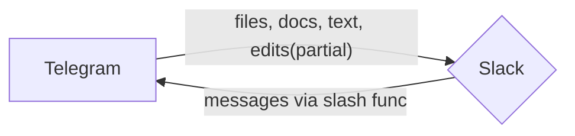

# T2S: Tg to Slack

This project is designed using [Bolt](https://api.slack.com/bolt) and the need to stream messages from TG to Slack channels / DMs. Essentially at the moment it does only that. 

---
### Installation: 
(requires Node.js installed)

```
npm install
```
---
### Usage
You will require to set up an `.env` file with the following parameters:
# Connection configuration
- INBOUND_PORT = `your port`

- TELEGRAM
TG_API_TOKEN=`your token` 
TG_URL='https://api.telegram.org' `that's a base tg api url` 
TG_TEST_GROUP=`handy grp id to test` (should be PROD data on prod) 
TG_TEST_USER=`handy user id to test` (should be PROD data on prod) 

- SLACK
SLACK_API_TOKEN=`Your Slack token` 
SLACK_SIGNIN_SECRET=`Your Slack Signin secret` 
SLACK_TEST_USER_ID=`handy user id to test` (should be PROD data on prod) 
SLACK_TEST_CHANNEL_ID=`handy grp id to test` (should be PROD data on prod) 


In it's current form the app just echoes anything Telegram Bot receives to a selected Slack channel and some text can go back. 

To run the app do: 
```
node bot.js
```

Once the app is running: sending the message to a Telegram bot (TG_API_TOKEN) will echo the message to Slack (SLACK_TEST_USER_ID) via SLACK_API_TOKEN

---
### TODO
- I accept feature requests
- [x] *DONE* Add user recognition for platforms transitioning (so peeps in Slack see, who wrote what in TG)
- [x] *DONE* ~~Improve project structure to add various kinds of messages / formatting 
    - here we can introduce something like an object file that will contain required formats, and invoke those formats on demand. 
    - added a workaround notification about media messages <- ~~I just implemented :file recognition method from Grammy and echo files directly to slack (20Mb max atm). After that the file is deleted from server permanently - no retries~~
- [x] *DONE* Handle file errors in TG correctly (currently may fake unsuccessful file upload)
- [x] *DONE* Handle stickers in TG and maybe somethign to show similarities in slack 
- [x] *DONE* Implement backwards compatiability, allowing sending messages from Slack to TG
	- in order to do so we want to map message types from TG to Slack and vice versa. This map requires learning types of `message` and comparing those to slack
- [x] *DONE* It would be nice to figure out handling images and another kinds of content transitioning --> [docs](https://grammy.dev/plugins/files)
- [x] *DONE* Moved tg logic to local Express.js app
- Move slack logic to local Express.js app
- Update Dockerfile
- Update Schema (maybe :D)