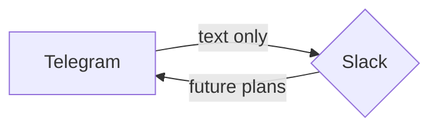

# T2S: Tg to Slack

This project is designed based on [grammY](https://github.com/grammyjs/grammY) and the need to stream messages from TG to Slack channels / DMs. Essentially at the moment it does only that. 

---
### Installation: 
(requires Node.js installed)

```
npm install
```
---
### Usage
You will require to set up an `.env` file with the following parameters:
- TELEGRAM bot:
	-  TG_API_TOKEN=`YOUR_BOT_TOKEN_HERE`
- SLACK:
	- SLACK_API_TOKEN=`YOUR_SLACK_APP_TOKEN`
	- SLACK_TEST_USER_ID=`CHANNEL_ID`

In it's current form the app just echoes anything Telegram Bot receives to a selected Slack channel. 

To run the app do: 
```
node bot.js
```

Once the app is running: sending the message to a Telegram bot (TG_API_TOKEN) will echo the message to Slack (SLACK_TEST_USER_ID) via SLACK_API_TOKEN

---
### TODO
- I accept feature requests
- [x] *DONE* Add user recognition for platforms transitioning (so peeps in Slack see, who wrote what in TG)
- Improve project structure to add various kinds of messages / formatting 
    - here we can introduce something like an object file that will contain required formats, and invoke those formats on demand. 
    - added a workaround notification about media messages
- Implement a backwards compatiability, allowing sending messages from Slack to TG
- It would be nice to figure out handling images and another kinds of content transitioning --> [docs](https://grammy.dev/plugins/files)